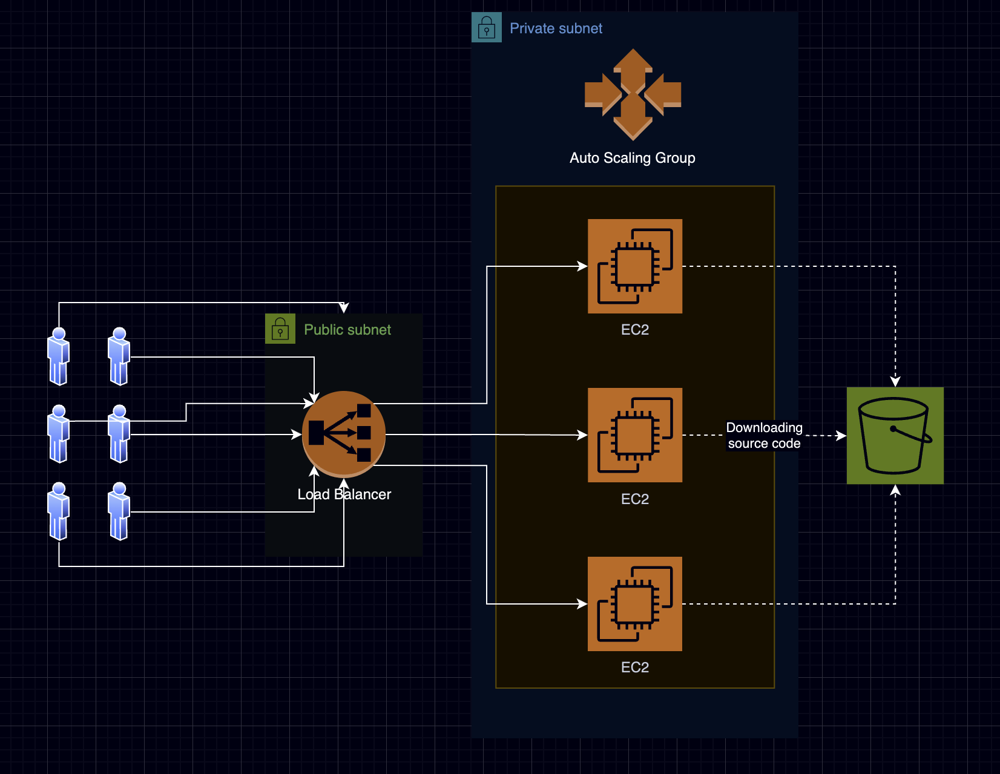

# AWS Compute Static Web App

Terraform manifest deploys static web page on AWS compute resources.

## Table of contents

- [Solution architecture](#solution-architecture)
- [Project structure](#project-structure)
- [Requirements](#requirements)
- [How to use](#how-to-use)
  - [Authentication to AWS](#authentication-to-aws)
  - [Terraform initialization](#terraform-initialization)
  - [Terraform plan](#terraform-plan)
  - [Terraform apply](#terraform-apply)
  - [Terraform destroy](#terraform-destroy)

## Solution architecture



## Project structure

Main directory contains Terraform module calls, variables and provider configuration.

Other directories:

- `modules` directory contains Terraform modules
- `web_app` directory stores application files
- `docs` directory holds `README.md` file

## Requirements

- AWS Account
- IAM User with permissions policies: `AmazonDynamoDBFullAccess`, `AmazonDynamoDBFullAccess`, `AmazonEC2FullAccess`, `AmazonS3FullAccess`, `AmazonVPCFullAccess` and `IAMFullAccess`
- S3 Bucket for storage the state file
- DynamoDB Table for locking the state file
- Terraform 1.9

## How to use

### Authentication to AWS

For authentication Terraform use IAM User access key. To use it key ID and secret key must be declared as environment variables.

```bash
export AWS_ACCESS_KEY_ID="$KEY_ID"
export AWS_SECRET_ACCESS_KEY="$KEY_SECRET"
```

### Terraform initialization

After cloning the repository, a working directory must be initialized. This includes downloading the required providers and connecting to the remote state file. To achieve this, execute:

```bash
terraform init
```

Initialization is required to run once, but it is safe to execute multiple times.

### Terraform plan

To generate and review the execution plan, which outlines the changes Terraform will make to the infrastructure, perform:

```bash
terraform plan
```

### Terraform apply

To apply the changes specified in the execution plan to the infrastructure, implement:

```bash
terraform apply
```

### Terraform destroy

To destroy the infrastructure created by the project, use:

```bash
terraform destroy
```
